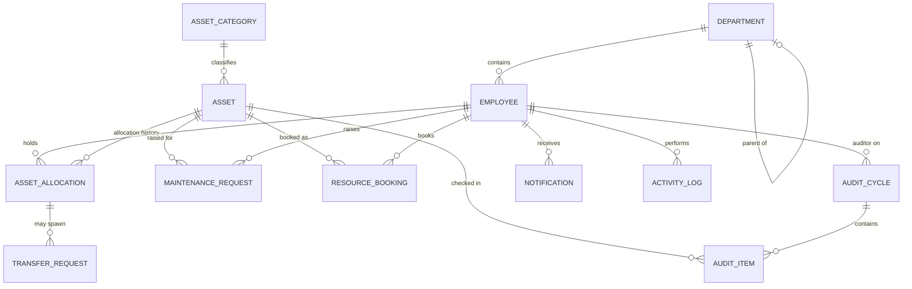
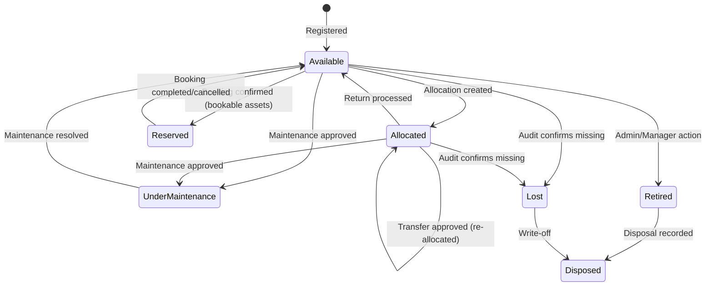

# AssetFlow — Product Requirements Document (PRD)
### Enterprise Asset & Resource Management System
**Version:** 1.0 · **Prepared for:** Hackathon Build · **Status:** Draft for Dev Kickoff

---

## 1. Executive Summary

AssetFlow is a role-based ERP module that lets any organization (offices, schools, hospitals, factories, agencies) track physical assets end-to-end — from registration to disposal — while also managing shared-resource bookings, maintenance approvals, and periodic audits. It deliberately excludes purchasing/invoicing/accounting to stay scoped and shippable in a hackathon timeframe.

**Core promise:** *Know what you own, who has it, where it is, and whether it's healthy — in real time.*

### Why this can win
Most hackathon CRUD apps stop at "create/read/update/delete." AssetFlow's differentiators are the things judges actually score highly: **conflict-safe state machines** (allocation conflicts, booking overlaps), **multi-step approval workflows** (maintenance, transfers, audits), and **realistic RBAC** (no self-assigned admin). Nailing these three mechanics — not just the screens — is what separates a winning build from a form-filling demo.

---

## 2. Goals & Non-Goals

### Goals
- Centralize asset lifecycle tracking across 7 states with guarded transitions.
- Prevent double-allocation and overlapping bookings at the data layer, not just the UI.
- Enforce realistic RBAC: signup only creates Employees; elevation happens only via Admin action.
- Provide a live KPI dashboard and notification feed so no role has to "go dig for updates."
- Support structured maintenance and audit workflows with auto-generated discrepancy reports.

### Non-Goals (explicitly out of scope)
- Purchasing, procurement, invoicing, or accounting integration.
- Multi-tenant billing (single-organization deployment is enough for the demo).
- Native mobile apps (a responsive web app covers the mobile-gesture requirement).

### Success Metrics (demo-day proxies)
| Metric | Target |
|---|---|
| Double-allocation attempts blocked | 100% |
| Overlapping bookings blocked | 100% |
| Maintenance request reaching "Resolved" without a manual DB edit | 100% of demo path |
| Audit cycle → discrepancy report generated automatically | Yes |
| Dashboard KPI refresh latency after an action | < 2s (via realtime or polling) |

---

## 3. Personas & Roles

| Role | Created by | Key powers |
|---|---|---|
| **Employee** | Self-signup | View own allocations, book resources, raise maintenance requests, initiate return/transfer |
| **Department Head** | Promoted by Admin | Everything Employee has + view dept. assets, approve allocation/transfer requests within dept., book on behalf of dept. |
| **Asset Manager** | Promoted by Admin | Register/allocate assets, approve transfers, approve maintenance requests, approve returns & condition check-ins |
| **Admin** | Seeded / first account | Org setup (departments, categories, employee directory), role promotion, audit cycle creation, org-wide analytics |

**Critical rule:** the signup form has **no role field**. Every new account is `Employee` by default. Role changes happen in exactly one place — the Employee Directory tab inside Organization Setup — and only Admin can do it. This should be enforced both in UI (no role selector anywhere else) and at the API layer (reject any request that tries to set `role` outside that one endpoint, and reject a self-promotion attempt even if someone crafts the request manually).

---

## 4. System-Wide Data Model



### Core Entities (fields)

**Department**: id, name, parentDepartmentId (nullable), departmentHeadId, status (Active/Inactive)

**AssetCategory**: id, name, customFieldsSchema (JSON — e.g. warranty period for Electronics)

**Employee**: id, name, email, passwordHash, departmentId, role (Employee/DeptHead/AssetManager/Admin), status

**Asset**: id, name, categoryId, assetTag (auto: `AF-0001`), serialNumber, acquisitionDate, acquisitionCost (report-only), condition, location, photos[], documents[], isBookable (bool), qrCodeValue, currentStatus (enum, see §5), currentHolderId (nullable, denormalized for fast lookup)

**AssetAllocation** (history table): id, assetId, employeeId/departmentId, allocatedAt, expectedReturnDate, returnedAt, conditionAtCheckIn, status (Active/Returned/Overdue)

**TransferRequest**: id, assetId, fromEmployeeId, toEmployeeId, status (Requested/Approved/Rejected), approvedById, requestedAt, resolvedAt

**ResourceBooking**: id, assetId (must be `isBookable=true`), bookedById, departmentId (optional, for "on behalf of"), startTime, endTime, status (Upcoming/Ongoing/Completed/Cancelled)

**MaintenanceRequest**: id, assetId, raisedById, issueDescription, priority, photo, status (Pending/Approved/Rejected/TechnicianAssigned/InProgress/Resolved), approvedById, technicianName, timestamps per stage

**AuditCycle**: id, scopeDepartmentId/scopeLocation, startDate, endDate, status (Draft/Active/Closed), auditorIds[]

**AuditItem**: id, auditCycleId, assetId, result (Verified/Missing/Damaged), note, resolvedStatus

**Notification**: id, employeeId, type, message, isRead, createdAt

**ActivityLog**: id, actorId, action, entityType, entityId, metadata (JSON), timestamp

---

## 5. Asset Lifecycle — State Machine (the heart of the system)



**Guard rules to implement in the backend (not just UI):**
1. `Allocate(asset, employee)` → reject with `409 Conflict` if `asset.currentStatus != Available`. Response payload must include current holder's name so the UI can render "currently held by Priya" + offer **Transfer Request**.
2. `Book(asset, slot)` → reject if any existing booking on that asset has `start < requestedEnd AND end > requestedStart` (half-open interval overlap check — a booking starting exactly when another ends is allowed).
3. `ApproveMaintenance(request)` → asset must be `Available` or `Allocated`; on approval, asset flips to `UnderMaintenance` and no new allocation/booking can be created against it until `Resolved`.
4. `CloseAuditCycle(cycle)` → for every `AuditItem` with result `Missing`, cascade `asset.currentStatus = Lost`; for `Damaged`, keep status but flag for maintenance; cycle becomes immutable after close.
5. Every transition writes an `ActivityLog` row — this is what powers Screen 10 and also proves data integrity to judges live.

---

## 6. Functional Requirements by Screen

### 6.1 Login / Signup
- Signup: name, email, password → creates Employee, department left "unassigned" until Admin assigns, or optional department picker at signup (no role field, ever).
- Login: email/password, JWT issued, refresh token, "forgot password" via email OTP/link.
- Session validation middleware on every protected route; expired/invalid token → 401 → redirect to login.

### 6.2 Dashboard
- KPI cards (role-scoped: Admin/AssetManager see org-wide; DeptHead/Employee see scoped-down numbers): Assets Available, Assets Allocated, Maintenance Today, Active Bookings, Pending Transfers, Upcoming Returns.
- Overdue section visually separated (red accent) from upcoming (amber/neutral).
- Quick actions as buttons that deep-link into Screens 4/6/7's create flows.

### 6.3 Organization Setup (Admin-only, 3 tabs)
- **Departments**: CRUD, parent department dropdown (prevent circular hierarchy), head assignment, Active/Inactive toggle (soft-deactivate, never hard delete if assets/employees reference it).
- **Asset Categories**: CRUD, dynamic custom-field builder (key/type pairs stored as JSON schema, rendered dynamically on Asset Registration form).
- **Employee Directory**: table with filters (department/role/status), inline "Promote to Dept Head / Asset Manager" action — this is the *only* role-mutation entry point in the entire app.

### 6.4 Asset Registration & Directory
- Registration form: name, category (pulls custom fields), auto-generated tag, serial number, acquisition date & cost, condition, location, photo/doc upload, bookable flag, QR code auto-generated from asset tag.
- Directory: search/filter by tag, serial, QR scan, category, status, department, location; status badges color-coded per lifecycle state.
- Asset detail drawer: tabs for Allocation History and Maintenance History, both pulled from the respective tables filtered by `assetId`.

### 6.5 Asset Allocation & Transfer
- Allocate form: pick employee or department, optional expected return date.
- Conflict UX: on 409 from backend, show modal "Currently held by Priya (since 12 Jun)" with a **Request Transfer** CTA that pre-fills a TransferRequest.
- Transfer workflow board: Requested → Approved (Asset Manager/Dept Head) → Re-allocated, with history entries auto-created.
- Return flow: mark returned + condition check-in notes → asset reverts to Available, allocation row closed with `returnedAt`.
- Overdue engine: scheduled job (cron) flags allocations past `expectedReturnDate`, creates Notification + feeds Dashboard.

### 6.6 Resource Booking
- Calendar view (week/day) per resource, color-coded by status.
- Overlap validation on submit (half-open interval rule from §5).
- Status auto-transitions: Upcoming → Ongoing → Completed via scheduled job comparing current time to slot bounds; Cancelled is user-triggered.
- Reminder notification N minutes before start (configurable, default 15 min).

### 6.7 Maintenance Management
- Raise request: asset picker, issue text, priority (Low/Med/High/Critical), photo upload.
- Kanban-style workflow board: Pending → Approved/Rejected → Technician Assigned → In Progress → Resolved.
- Status side-effects: Approved ⇒ asset → UnderMaintenance; Resolved ⇒ asset → Available (unless it was Lost/Retired going in, edge case to guard against).
- Maintenance history tab reused on Asset Detail (Screen 4).

### 6.8 Asset Audit
- Create Audit Cycle: scope (department or location), date range, assign auditors (multi-select employees).
- Auditor working view: checklist of in-scope assets, mark Verified/Missing/Damaged + note.
- Auto-generated Discrepancy Report: any non-Verified item rolls into a report view, exportable.
- Close Cycle: locks further edits, cascades status updates (Missing → Lost), cycle appears read-only in Audit History thereafter.

### 6.9 Reports & Analytics
- Utilization trend (most-used vs idle, based on allocation/booking frequency over time).
- Maintenance frequency by asset/category (bar chart).
- Assets nearing retirement / due for maintenance (rule-based list, e.g. age > threshold or last-maintenance > N months).
- Department-wise allocation summary (stacked bar or table).
- Booking heatmap (day-of-week × hour-of-day grid, color intensity = booking count).
- Export to CSV/PDF.

### 6.10 Activity Logs & Notifications
- Notification center: bell icon, unread count, mark-as-read, filter by type.
- Notification types: Asset Assigned, Maintenance Approved/Rejected, Booking Confirmed/Cancelled/Reminder, Transfer Approved, Overdue Return Alert, Audit Discrepancy Flagged.
- Full activity log table (Admin/Manager view): actor, action, entity, timestamp, filterable — this doubles as your live "proof of correctness" demo screen for judges.

---

## 7. Non-Functional Requirements

- **Security**: bcrypt/argon2 password hashing, JWT with short-lived access + refresh token rotation, RBAC middleware on every route (not just UI hiding), input validation (Zod/Joi) on all mutations.
- **Data integrity**: allocation/booking conflict checks must happen inside a DB transaction (`SERIALIZABLE` isolation or row-level locking) to survive concurrent requests — this is a common hackathon judge "gotcha" test (two people clicking allocate at the same instant).
- **Performance**: dashboard KPIs should be indexed/aggregated queries, not full-table scans; paginate all list views.
- **Auditability**: every state-changing action writes an ActivityLog row (see §5).
- **Responsiveness**: mobile-first breakpoints; table views collapse to cards under ~640px.
- **Accessibility**: color is never the *only* signal for status (use icon + text label alongside color badges).

---

## 8. Basic UI Gestures & Interaction Patterns

These are the touch/mouse interaction conventions to keep consistent across all 10 screens — judges notice consistency.

| Gesture / Pattern | Where used | Behavior |
|---|---|---|
| **Swipe left on a list row** (mobile) | Notifications, Maintenance queue | Reveals quick actions: Mark Read / Approve / Reject |
| **Long-press a KPI card** | Dashboard | Shows a tooltip breakdown (e.g. "Maintenance Today: 3 High priority, 2 Medium") |
| **Drag-and-drop between columns** | Maintenance workflow board, Transfer workflow board | Moves a request to the next status *only if* the guard rule allows it; invalid drop snaps back with a toast explaining why |
| **Drag on calendar grid** | Resource Booking | Click-and-drag to select a time range, auto-fills the booking form; overlapping ranges show a red hatch preview before submit |
| **Pull-to-refresh** (mobile) | Dashboard, Asset Directory | Re-fetches KPIs / list |
| **Tap-and-hold on QR icon** | Asset Directory | Opens camera-based QR scanner to jump straight to that asset's detail drawer |
| **Swipe between tabs** | Organization Setup (3 tabs), Asset Detail (Allocation/Maintenance history) | Horizontal swipe switches tab instead of only tap |
| **Inline expand (chevron tap)** | Audit checklist, Discrepancy report | Expands row to show note field and photo without navigating away |
| **Sticky action bar** | All multi-step forms (Registration, Maintenance raise, Audit cycle create) | "Save & Continue" stays pinned at bottom on scroll, especially on mobile |
| **Toast + undo** | Cancel booking, Reject request | 5-second undo window before the action is finalized, reduces accidental clicks |
| **Modal confirm with context** | Any Approve/Reject/Close-cycle action | Never a bare "Are you sure?" — always shows the specific entity ("Close Audit Cycle: Q3 HQ Floor 2? This locks 42 items.") |

**Visual language conventions**:
- Status badges: consistent color mapping across every screen — Available (green), Allocated (blue), Reserved (purple), Under Maintenance (amber), Lost (red), Retired (grey), Disposed (dark grey/strikethrough).
- Role-based nav: sidebar items are rendered conditionally per role, not just disabled — a Employee should never even see an "Org Setup" link in the DOM.

---

## 9. Recommended Tech Stack (optimized for hackathon speed + judge impact)

The priorities for a hackathon stack are: **(1) fast to build, (2) visually polished with minimal custom CSS effort, (3) handles real-time/relational complexity without fighting the framework, (4) easy to deploy/demo live.**

### Frontend
| Layer | Choice | Why |
|---|---|---|
| Framework | **React 18 + TypeScript + Vite** | Fastest iteration loop, huge ecosystem, judges recognize it instantly |
| Styling/UI kit | **Tailwind CSS + shadcn/ui** | Pre-built accessible components (dialogs, tables, tabs, dropdowns) that still look custom, not "bootstrap-y" |
| Routing | **React Router v6** | Standard, simple nested routes for role-based layouts |
| State/data | **TanStack Query** (server state) + **Zustand** (light UI state) | Query handles caching/refetch/optimistic updates for allocations & bookings; Zustand avoids Redux boilerplate |
| Calendar/Booking UI | **react-big-calendar** or **FullCalendar** | Drag-to-select time ranges, overlap rendering out of the box |
| Charts | **Recharts** | Clean, composable charts for Screen 9 |
| QR codes | **qrcode.react** (generate) + **html5-qrcode** (scan) | Genuinely impressive live demo moment — scan a printed asset tag on stage |
| Forms/validation | **React Hook Form + Zod** | Fast form building with schema validation shared with backend |
| Realtime updates | **Socket.io-client** | Live dashboard KPI + notification badge updates without polling |

### Backend
| Layer | Choice | Why |
|---|---|---|
| Runtime/Framework | **Node.js + Express (TypeScript)**, or **NestJS** if the team wants stronger structure out of the box | Nest gives you modules/guards/DI matching the RBAC needs almost for free; Express if the team wants max speed and fewer conventions to learn |
| ORM | **Prisma** | Type-safe queries, migrations, and the schema.prisma file doubles as living documentation of §4's data model |
| Database | **PostgreSQL** | Relational integrity is core to this problem (conflicts, overlaps, foreign keys) — do not use a document DB here |
| Auth | **JWT (access + refresh) + bcrypt**, custom RBAC middleware | Full control over the "no self-elevation" rule, which is a graded requirement |
| Realtime | **Socket.io (server)** | Emits events on allocation/booking/maintenance/audit changes → drives notification + dashboard live-updates |
| Validation | **Zod** shared between client/server via a shared `types` package (if monorepo) | One source of truth for request shapes |
| Scheduled jobs | **node-cron** | Overdue-return flagging, booking status transitions (Upcoming→Ongoing→Completed), reminder notifications |
| File storage | **Cloudinary** (free tier) | Asset photos/docs, maintenance photos — signed upload widget, zero infra to manage |

### Infra / Deployment (optimize for a working live URL, not perfect DevOps)
| Layer | Choice | Why |
|---|---|---|
| DB hosting | **Supabase** or **Neon** (managed Postgres, free tier) | Zero local DB setup, connection string ready in minutes |
| Backend hosting | **Render** or **Railway** | One-click deploy from GitHub, free tier fine for a demo |
| Frontend hosting | **Vercel** | Instant preview URLs, great for judges to open on their own device |
| Monorepo tooling | **Turborepo** (optional, if time allows) | Shared types/Zod schemas between frontend/backend |

### Alternative "even faster" stack (if the team is small / time-boxed hard)
Use **Next.js 14 (App Router)** as a full-stack framework — API routes replace the separate Express server, **Supabase** provides Postgres + Auth + Storage + Realtime out of the box, cutting integration work roughly in half. Trade-off: less separation of concerns, but for a hackathon judged on working features over architecture purity, this is often the faster path to a demoable product.

### Suggested repo structure
```
/apps
  /web        → React (or Next.js) frontend
  /api        → Express/Nest backend
/packages
  /shared     → Zod schemas + TS types shared by both
prisma/
  schema.prisma
```

---

## 10. MVP Prioritization (build order for limited hackathon hours)

**Tier 1 — must work flawlessly (judged core mechanics):**
1. Auth + RBAC (signup as Employee only, Admin promotion flow)
2. Org Setup (departments, categories, directory)
3. Asset Registration + Directory with lifecycle states
4. Allocation with conflict blocking + Transfer request flow
5. Resource Booking with overlap validation

**Tier 2 — workflow depth (differentiators):**
6. Maintenance approval workflow with status-driven asset state changes
7. Dashboard KPIs + overdue flagging
8. Notifications (even if polling instead of real Socket.io, if time-boxed)

**Tier 3 — polish & wow-factor (if time remains):**
9. Audit cycles + auto discrepancy report
10. Reports & Analytics (charts)
11. QR code generate/scan live demo
12. Real-time Socket.io push instead of polling

If time runs out, **cut Tier 3 before Tier 1/2** — a judge will forgive a missing chart, not a working double-allocation prevention.

---

## 11. Demo Script Suggestion (for judging)

1. Sign up as a new user → show it lands as plain Employee (prove no self-elevation).
2. Log in as Admin → create a department, promote that user to Asset Manager live.
3. As Asset Manager → register an asset, show auto-generated tag + QR code.
4. Allocate the asset to Employee A. Try allocating the *same* asset to Employee B → show the block + "currently held by" + Transfer Request CTA.
5. Book a shared room 9:00–10:00, then try 9:30–10:30 → show rejection; then book 10:00–11:00 → show it succeeds (exact edge-case from the spec).
6. Raise a maintenance request → approve it → show asset flip to Under Maintenance live on the dashboard → resolve it → flip back to Available.
7. Create an audit cycle, mark one asset Missing, close the cycle → show it auto-flips to Lost and a discrepancy report appears.
8. End on the Dashboard/Notifications screen showing every action from the last two minutes logged and reflected in KPIs in real time.

This script directly demonstrates every "hard" requirement in the problem statement in under 5 minutes.